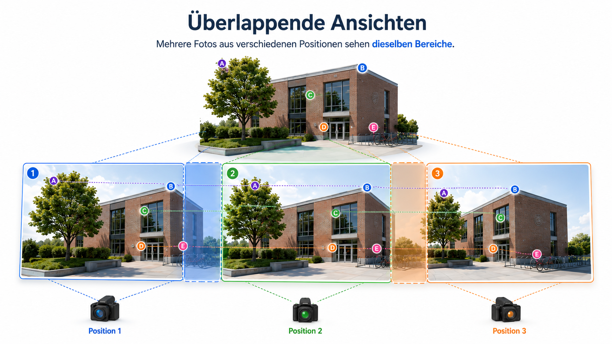
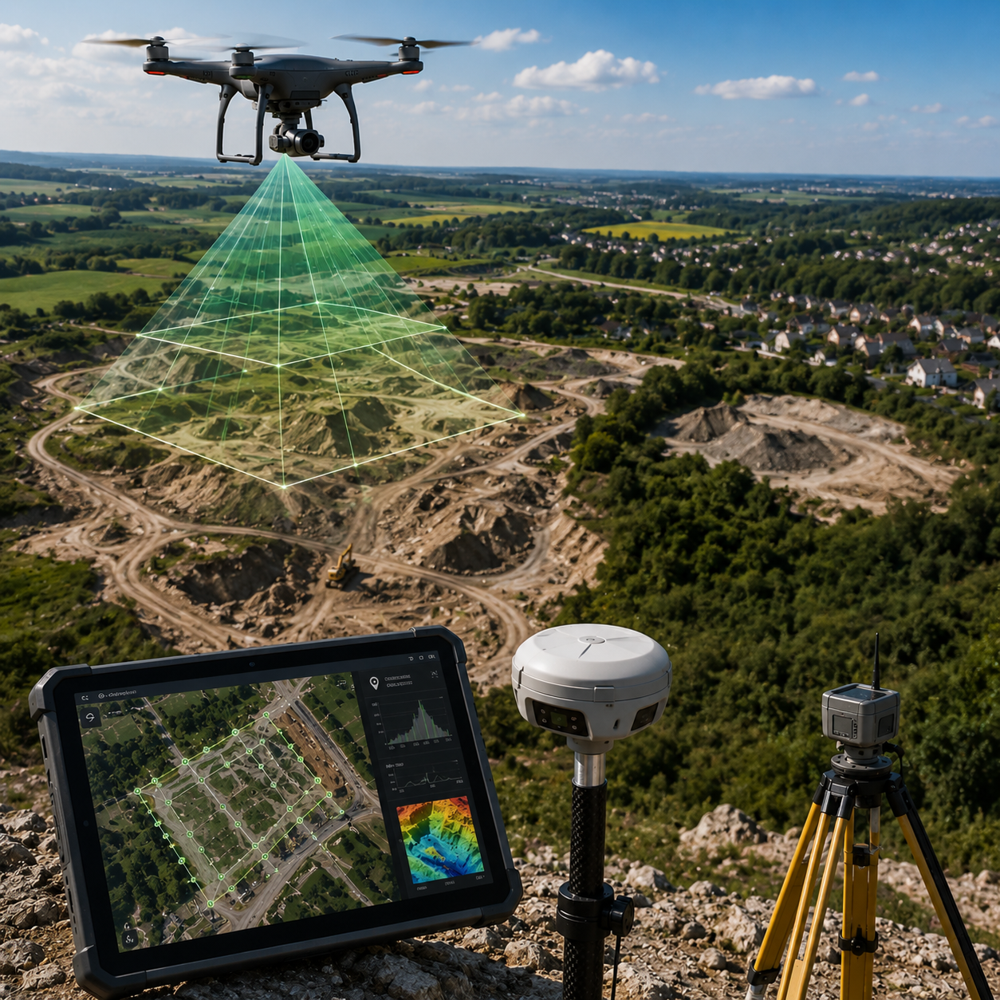
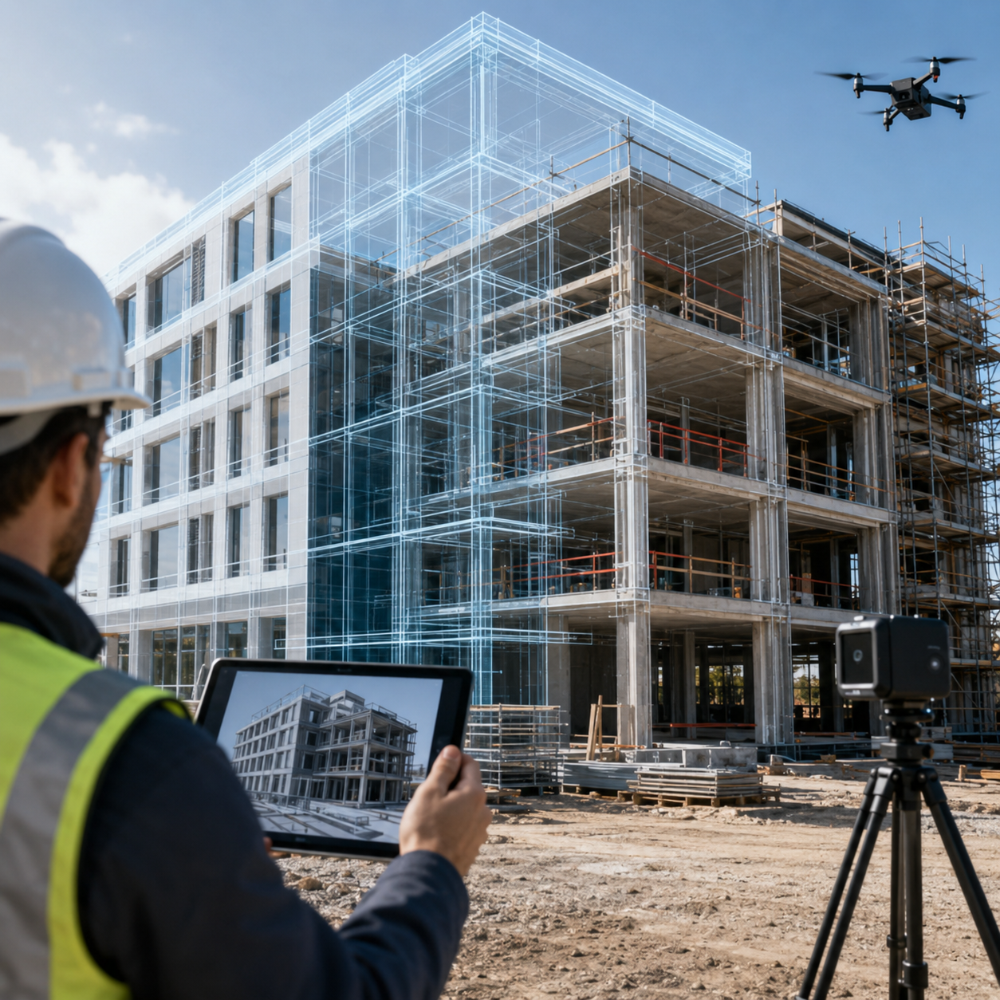
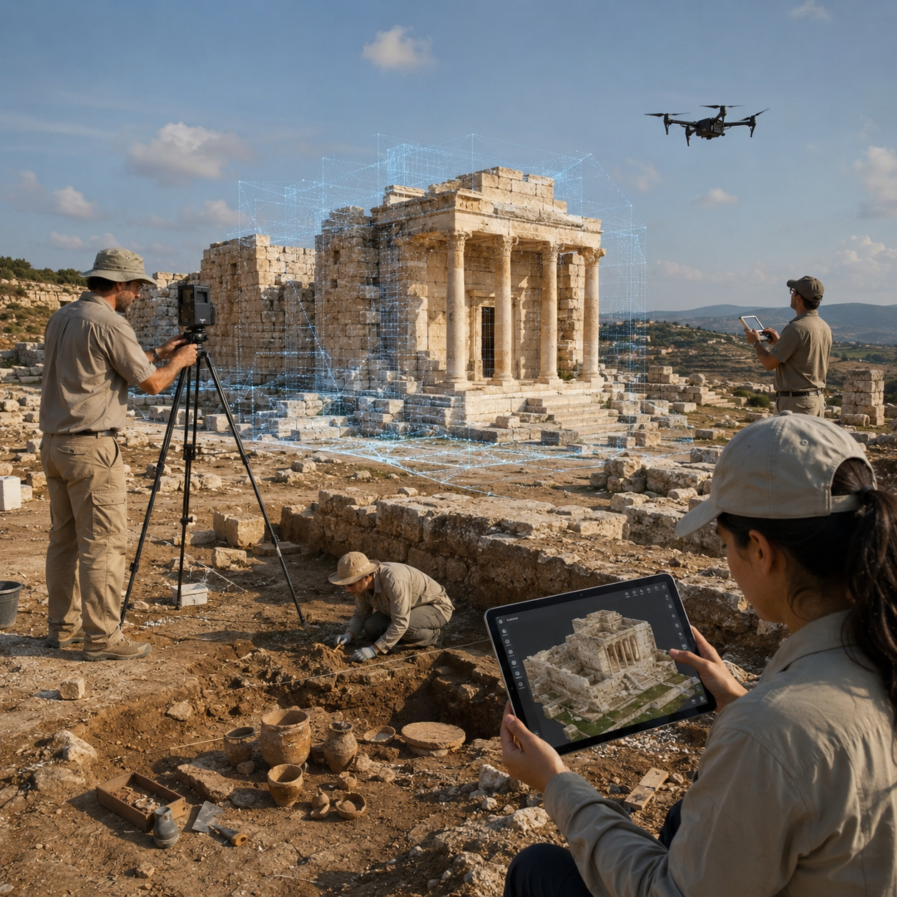
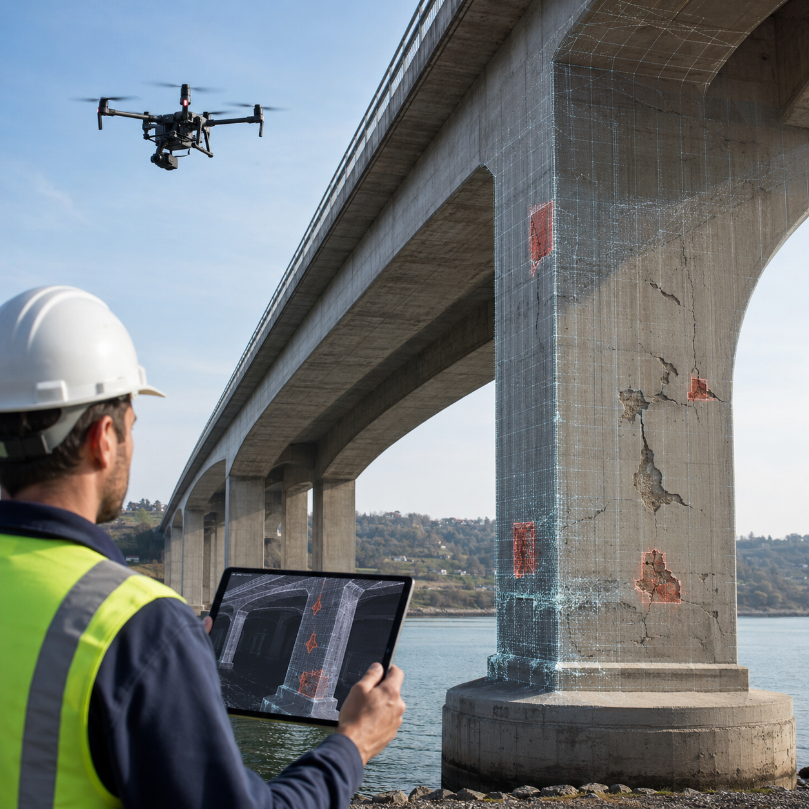
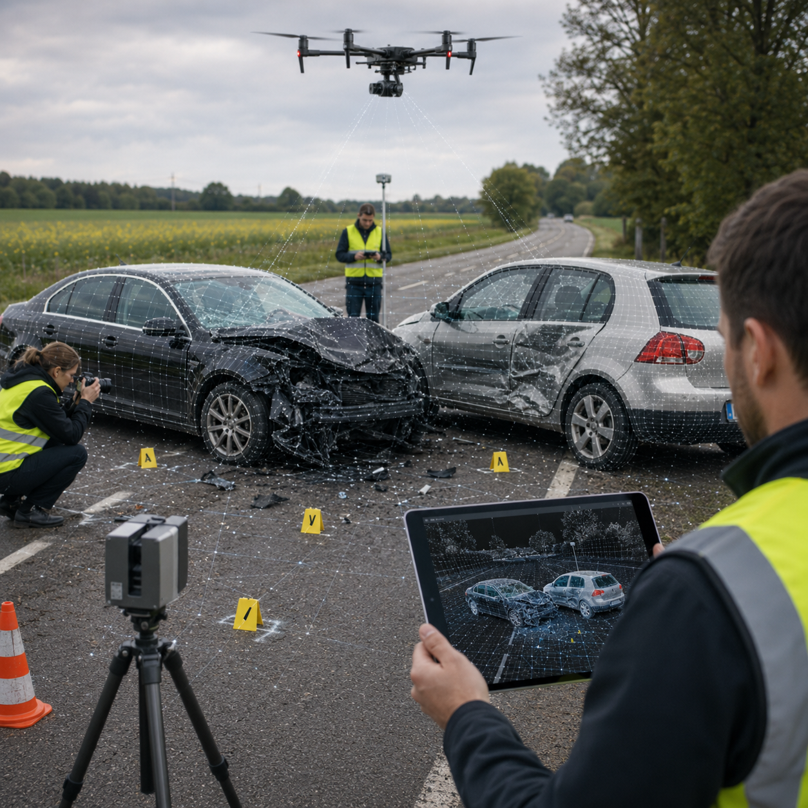
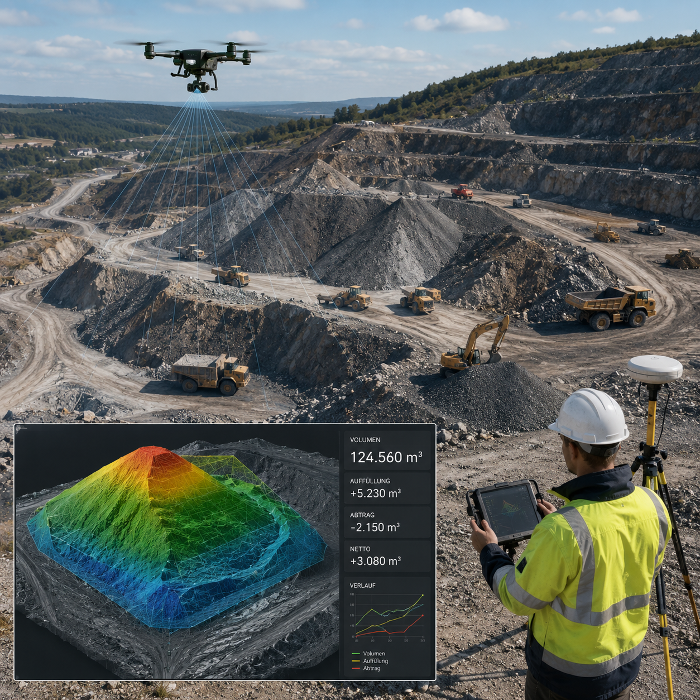
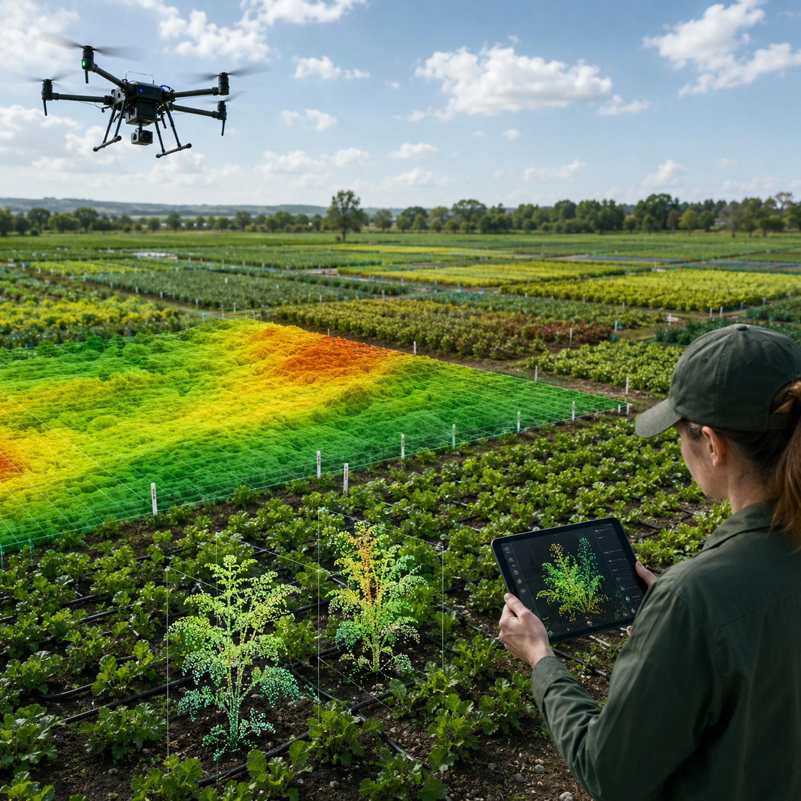

::: {.site-section-nav}
[Home](index.qmd)
[Motivation & Use-Cases](einleitung.qmd){.active}
[Theorie](theorie.qmd)
[Methoden-Vergleich](vergleich.qmd)
[Praktisches Beispiel](hands-on.qmd)
[Quellen](quellen.qmd)
:::

<style>
:root {
  --accent: #2563eb;
  --accent-light: color-mix(in srgb, var(--accent) 12%, transparent);
  --card-shadow: 0 2px 12px rgba(0,0,0,0.06);
  --radius: 0.75rem;
}

/* Hero */
.intro-hero {
  padding: 2.5rem 0 1.5rem;
  border-bottom: 1px solid var(--bs-border-color, #e5e5e5);
  margin-bottom: 2rem;
}
.intro-hero-eyebrow {
  text-transform: uppercase;
  letter-spacing: 0.1em;
  font-size: 0.72rem;
  font-weight: 700;
  color: var(--accent);
  margin-bottom: 0.5rem;
}
.intro-hero-title {
  font-size: clamp(1.8rem, 4vw, 2.8rem);
  font-weight: 800;
  line-height: 1.1;
  margin-bottom: 1rem;
}
.intro-hero-lead {
  max-width: 72ch;
  font-size: 1.05rem;
  line-height: 1.75;
  color: var(--bs-body-color);
}
.key-message {
  margin: 1.5rem 0 0;
  padding: 1rem 1.25rem;
  border-left: 4px solid var(--accent);
  border-radius: var(--radius);
  background: var(--accent-light);
  font-size: 0.98rem;
  line-height: 1.6;
}
.key-message strong {
  display: block;
  margin-bottom: 0.25rem;
}

/* Pipeline */
.pipeline {
  display: flex;
  flex-wrap: wrap;
  gap: 0.5rem;
  margin: 1.5rem 0 2rem;
  counter-reset: step;
}
.pipeline-step {
  flex: 1 1 120px;
  min-width: 100px;
  padding: 0.9rem 0.75rem;
  border: 1px solid var(--bs-border-color, #dcdcdc);
  border-radius: var(--radius);
  background: var(--bs-body-bg, #fff);
  text-align: center;
  position: relative;
  box-shadow: var(--card-shadow);
  transition: opacity 0.2s, transform 0.2s;
}
.pipeline-step::before {
  counter-increment: step;
  content: counter(step);
  display: block;
  width: 1.6rem;
  height: 1.6rem;
  margin: 0 auto 0.4rem;
  border-radius: 50%;
  background: var(--accent);
  color: #fff;
  font-size: 0.8rem;
  font-weight: 700;
  line-height: 1.6rem;
}
.pipeline-step strong {
  display: block;
  font-size: 0.88rem;
  margin-bottom: 0.2rem;
}
.pipeline-step span {
  font-size: 0.78rem;
  color: var(--bs-secondary-color, #666);
  line-height: 1.3;
}
.pipeline-step.dimmed {
  opacity: 0.35;
  transform: scale(0.97);
}
.pipeline-step.highlight {
  border-color: var(--accent);
  box-shadow: 0 0 0 2px var(--accent-light);
}


/* Fact strip */
.fact-strip {
  display: grid;
  grid-template-columns: repeat(auto-fit, minmax(180px, 1fr));
  gap: 0.75rem;
  margin: 1.4rem 0 2rem;
}
.fact-item {
  padding: 0.85rem 1rem;
  border: 1px solid var(--bs-border-color, #dcdcdc);
  border-radius: var(--radius);
  background: rgba(127,127,127,0.035);
}
.fact-item strong {
  display: block;
  font-size: 0.9rem;
  margin-bottom: 0.25rem;
}
.fact-item span {
  display: block;
  font-size: 0.82rem;
  line-height: 1.45;
  color: var(--bs-secondary-color, #666);
}

/* Source and note boxes */
.source-note,
.workflow-note {
  margin: 1rem 0 1.5rem;
  padding: 0.95rem 1rem;
  border-radius: var(--radius);
  background: rgba(127,127,127,0.045);
  border: 1px solid var(--bs-border-color, #dcdcdc);
  font-size: 0.92rem;
  line-height: 1.65;
}
.source-note strong,
.workflow-note strong {
  color: var(--accent);
}

/* Cards */
.card-grid {
  display: grid;
  grid-template-columns: repeat(auto-fit, minmax(260px, 1fr));
  gap: 1rem;
  margin: 1.25rem 0 2rem;
}
.card {
  border: 1px solid var(--bs-border-color, #dcdcdc);
  border-radius: var(--radius);
  padding: 1.1rem;
  background: var(--bs-body-bg, #fff);
  box-shadow: var(--card-shadow);
}
.card h3 {
  margin: 0 0 0.5rem;
  font-size: 1rem;
}
.card p {
  margin: 0 0 0.5rem;
  line-height: 1.6;
  font-size: 0.92rem;
}
.card-tag {
  display: inline-block;
  margin-bottom: 0.6rem;
  padding: 0.2rem 0.55rem;
  border-radius: 999px;
  font-size: 0.72rem;
  font-weight: 700;
  background: var(--accent-light);
  color: var(--accent);
}
.media-placeholder {
  min-height: 100px;
  border: 1px dashed var(--bs-secondary-color, #999);
  border-radius: calc(var(--radius) - 2px);
  display: grid;
  place-items: center;
  text-align: center;
  padding: 0.75rem;
  margin-bottom: 0.75rem;
  color: var(--bs-secondary-color, #666);
  font-size: 0.82rem;
  background: rgba(127,127,127,0.04);
}
.usecase-image {
  width: 100%;
  aspect-ratio: 1 / 1;
  object-fit: cover;
  display: block;
  margin-bottom: 0.85rem;
  border-radius: calc(var(--radius) - 2px);
  border: 1px solid var(--bs-border-color, #dcdcdc);
  background: #f8fafc;
}

/* Use-Case Accordion */
.usecase-accordion {
  display: grid;
  gap: 0.75rem;
  margin: 1.25rem 0 2.25rem;
}

.usecase-item {
  border: 1px solid var(--bs-border-color, #dcdcdc);
  border-radius: var(--radius);
  background: var(--bs-body-bg, #fff);
  box-shadow: var(--card-shadow);
  overflow: hidden;
}

.usecase-item summary {
  list-style: none;
  cursor: pointer;
  padding: 1rem 1.15rem;
  display: flex;
  justify-content: space-between;
  align-items: center;
  gap: 1rem;
  background: rgba(127,127,127,0.035);
  transition: background 0.18s ease, color 0.18s ease;
}

.usecase-item summary::-webkit-details-marker {
  display: none;
}

.usecase-item summary::after {
  content: "+";
  flex: 0 0 auto;
  width: 1.75rem;
  height: 1.75rem;
  border-radius: 999px;
  display: grid;
  place-items: center;
  background: var(--accent-light);
  color: var(--accent);
  font-weight: 800;
  font-size: 1.05rem;
  transition: transform 0.18s ease, background 0.18s ease;
}

.usecase-item[open] summary {
  background: var(--accent-light);
}

.usecase-item[open] summary::after {
  content: "–";
  background: var(--accent);
  color: #fff;
}

.usecase-title {
  font-weight: 750;
  font-size: 1rem;
}

.usecase-meta {
  margin-left: auto;
  font-size: 0.82rem;
  color: var(--bs-secondary-color, #666);
  white-space: nowrap;
}

.usecase-content {
  display: grid;
  grid-template-columns: minmax(160px, 0.48fr) minmax(300px, 1.52fr);
  gap: 1rem;
  padding: 1rem 1.15rem 1.15rem;
  align-items: start;
}

.usecase-accordion-image {
  width: 100%;
  max-width: 260px;
  aspect-ratio: 1 / 1;
  object-fit: contain;
  justify-self: center;
  border-radius: calc(var(--radius) - 2px);
  border: 1px solid var(--bs-border-color, #dcdcdc);
  background: #f8fafc;
  display: block;
}

.usecase-text p {
  margin: 0 0 0.75rem;
  line-height: 1.6;
  font-size: 0.93rem;
}


.usecase-facts {
  display: grid;
  grid-template-columns: repeat(auto-fit, minmax(150px, 1fr));
  gap: 0.55rem;
  margin: 0.75rem 0 0.85rem;
}
.usecase-fact {
  padding: 0.55rem 0.65rem;
  border-radius: calc(var(--radius) - 3px);
  background: rgba(37, 99, 235, 0.075);
  font-size: 0.8rem;
  line-height: 1.35;
}
.usecase-fact strong {
  display: block;
  color: var(--accent);
  margin-bottom: 0.12rem;
}

.usecase-note {
  padding: 0.75rem 0.85rem;
  border-radius: calc(var(--radius) - 2px);
  background: rgba(127,127,127,0.055);
  color: var(--bs-secondary-color, #666);
  font-size: 0.86rem !important;
}

@media (max-width: 760px) {
  .usecase-item summary {
    align-items: flex-start;
  }

  .usecase-meta {
    display: none;
  }

  .usecase-content {
    grid-template-columns: 1fr;
  }
}

/* Comparison */
.comparison-box {
  margin: 1.5rem 0 2rem;
  padding: 1rem 1.15rem;
  border-radius: var(--radius);
  border: 1px solid var(--bs-border-color, #dcdcdc);
  background: rgba(127,127,127,0.03);
}
.comparison-box ul {
  margin: 0.5rem 0 0;
  padding-left: 1.25rem;
}
.comparison-box li {
  margin-bottom: 0.35rem;
}

/* Interactive Demo */
.demo-container {
  border: 1px solid var(--bs-border-color, #dcdcdc);
  border-radius: var(--radius);
  padding: 1.25rem;
  margin: 1.5rem 0 2rem;
  background: var(--bs-body-bg, #fff);
  box-shadow: var(--card-shadow);
}
.demo-controls {
  display: flex;
  flex-wrap: wrap;
  gap: 0.5rem;
  margin-bottom: 1rem;
}
.demo-controls button {
  padding: 0.4rem 0.9rem;
  border: 1px solid var(--bs-border-color, #ccc);
  border-radius: 0.5rem;
  background: #fff;
  font-size: 0.85rem;
  cursor: pointer;
  transition: all 0.15s;
}
.demo-controls button:hover {
  border-color: var(--accent);
  color: var(--accent);
}
.demo-controls button.active {
  background: var(--accent);
  color: #fff;
  border-color: var(--accent);
}
.demo-result {
  padding: 1rem;
  border-radius: calc(var(--radius) - 2px);
  background: var(--accent-light);
  min-height: 80px;
}
.demo-result-layout {
  display: grid;
  grid-template-columns: minmax(240px, 0.9fr) minmax(280px, 1.1fr);
  gap: 1rem;
  align-items: start;
}
.demo-result-image {
  width: 100%;
  aspect-ratio: 16 / 9;
  object-fit: cover;
  border-radius: calc(var(--radius) - 2px);
  border: 1px solid var(--bs-border-color, #dcdcdc);
  background: #fff;
}
.demo-result-text {
  display: grid;
  gap: 0.8rem;
}
.demo-result h4 {
  margin: 0 0 0.4rem;
  font-size: 0.95rem;
}
.demo-result p {
  margin: 0;
  font-size: 0.88rem;
  line-height: 1.55;
}

/* Table tweaks */
table {
  font-size: 0.88rem;
  margin: 1rem 0 1.5rem;
}
th {
  font-weight: 600;
}

/* Responsive */
@media (max-width: 600px) {
  .pipeline {
    flex-direction: column;
  }
  .pipeline-step {
    flex: none;
  }
  .demo-result-layout {
    grid-template-columns: 1fr;
  }
}
</style>

```{=html}
<section class="intro-hero">
  <div class="intro-hero-eyebrow">Motivation & Use-Cases</div>
  <h1 class="intro-hero-title">Aus Fotos wird prüfbare 3D-Geometrie.</h1>
  
  <p class="intro-hero-lead">
    <strong>Structure-from-Motion (SfM)</strong> und <strong>Multi-View Stereo (MVS)</strong> bilden den klassischen photogrammetrischen Weg von vielen überlappenden Bildern zu einem expliziten 3D-Modell. SfM schätzt zuerst, wo die Kameras standen und welche grobe 3D-Struktur sichtbar ist. MVS verdichtet dieses Ergebnis anschließend zu Tiefeninformationen, dichten Punktwolken und Oberflächen.
  </p>

  <p class="intro-hero-lead">
    Der entscheidende Unterschied zu rein visuellen 3D-Verfahren ist nicht der Wow-Effekt, sondern die <strong>fachliche Nutzbarkeit</strong>: Ein SfM/MVS-Ergebnis kann skaliert, gemessen, annotiert, archiviert und in CAD-, GIS- oder BIM-Workflows weiterverwendet werden. Damit wird aus Fotomaterial eine Datengrundlage für Entscheidungen.
  </p>
</section>
```

## Die Pipeline im Überblick

```{=html}
<div class="pipeline-demo" id="pipeline-demo">

  <div class="pipeline" id="pipeline-viz">
    <button class="pipeline-step active" data-step="1" type="button">
      <strong>Fotos</strong>
      <span>überlappende Ansichten</span>
    </button>

    <button class="pipeline-step" data-step="2" type="button">
      <strong>Features</strong>
      <span>erkannte Bildpunkte</span>
    </button>

    <button class="pipeline-step" data-step="3" type="button">
      <strong>Matching</strong>
      <span>Punkt-Korrespondenzen</span>
    </button>

    <button class="pipeline-step" data-step="4" type="button">
      <strong>SfM</strong>
      <span>Posen + Sparse Cloud</span>
    </button>

    <button class="pipeline-step" data-step="5" type="button">
      <strong>MVS</strong>
      <span>Dense Reconstruction</span>
    </button>

    <button class="pipeline-step" data-step="6" type="button">
      <strong>Mesh</strong>
      <span>Oberfläche</span>
    </button>

    <button class="pipeline-step" data-step="7" type="button">
      <strong>Export</strong>
      <span>CAD / GIS / BIM</span>
    </button>
  </div>

  <div class="demo-result" id="demo-result">
    <div class="demo-result-layout">
      

      <div class="demo-result-text">
        <div>
          <h4>Was macht der Schritt?</h4>
          <p><strong>Fotos:</strong> Der Schritt sammelt überlappende Ansichten derselben Szene. Die Bilder sind die einzige Informationsquelle für spätere Features, Kameraposen, Tiefenkarten und Geometrie.</p>
        </div>

        <div>
          <h4>Problem: Was kann schiefgehen?</h4>
          <p>Zu wenig Überlappung, Bewegungsunschärfe, starke Belichtungswechsel oder spiegelnde und glatte Oberflächen führen dazu, dass spätere Schritte keine stabilen Bildinformationen finden.</p>
        </div>
      </div>
    </div>
  </div>

</div>
```

<script>
const pipelineData = {
  "1": {
    title: "Fotos",
    image: "images/1_Fotos__Einleitung_Interaktiver_Teil.png",
    alt: "Fotos als Eingabe der SfM-MVS-Pipeline",
    does: "<strong>Fotos:</strong> Der Schritt sammelt überlappende Ansichten derselben Szene. Die Bilder sind die einzige Informationsquelle für spätere Features, Kameraposen, Tiefenkarten und Geometrie.",
    problem: "Zu wenig Überlappung, Bewegungsunschärfe, starke Belichtungswechsel oder spiegelnde und glatte Oberflächen führen dazu, dass spätere Schritte keine stabilen Bildinformationen finden."
  },
  "2": {
    title: "Features",
    image: "images/2_Features__Einleitung_Interaktiver_Teil.png",
    alt: "Erkannte Bildmerkmale in Fotos",
    does: "<strong>Features:</strong> In den Bildern werden markante, wiedererkennbare Punkte gesucht, zum Beispiel Ecken, Kanten oder texturreiche Bereiche.",
    problem: "Auf glatten, einfarbigen, unscharfen oder spiegelnden Flächen werden zu wenige stabile Features erkannt. Dadurch fehlt die Grundlage für Matching und Kameraschätzung."
  },
  "3": {
    title: "Matching",
    image: "images/3_Matching__Einleitung_Interaktiver_Teil.png",
    alt: "Korrespondierende Bildpunkte zwischen mehreren Ansichten",
    does: "<strong>Matching:</strong> Gleiche Features werden zwischen verschiedenen Fotos einander zugeordnet. So erkennt das System, welcher Bildpunkt in mehreren Ansichten denselben realen Punkt zeigt.",
    problem: "Falsche Matches führen zu fehlerhaften 3D-Punkten, verzerrten Kameraposen oder Ausreißern in der Punktwolke. Deshalb müssen robuste Verfahren falsche Zuordnungen entfernen."
  },
  "4": {
    title: "SfM",
    image: "images/4_SfM__Einleitung_Interaktiver_Teil.png",
    alt: "Kameraposen und sparse Point Cloud durch Structure-from-Motion",
    does: "<strong>SfM:</strong> Aus den Matches werden Kamerapositionen und eine erste dünne 3D-Punktwolke geschätzt. Dieser Schritt erzeugt die geometrische Grundstruktur der Szene.",
    problem: "Wenn Matches instabil sind oder die Kamerapositionen ungünstig gewählt wurden, kann die Rekonstruktion verzerrt, unvollständig oder komplett fehlschlagen."
  },
  "5": {
    title: "MVS",
    image: "images/5_MVS__Einleitung_Interaktiver_Teil.png",
    alt: "Dichte Punktwolke durch Multi-View Stereo",
    does: "<strong>MVS:</strong> Die bekannten Kameraposen werden genutzt, um dichte Tiefeninformationen aus mehreren Ansichten zu berechnen. Daraus entsteht eine deutlich dichtere Punktwolke.",
    problem: "Schwache Textur, verdeckte Bereiche, Reflexionen oder starke Belichtungsunterschiede erzeugen Löcher, Rauschen oder ungenaue Tiefenwerte."
  },
  "6": {
    title: "Mesh",
    image: "images/6_Mesh__Einleitung_Interaktiver_Teil.png",
    alt: "Mesh aus dichter Punktwolke",
    does: "<strong>Mesh:</strong> Aus der dichten Punktwolke wird eine zusammenhängende Oberfläche rekonstruiert. Diese Oberfläche kann anschließend texturiert und visualisiert werden.",
    problem: "Ausreißer, Löcher oder zu geringe Punktdichte können zu Artefakten führen: offene Flächen, unruhige Oberflächen oder falsch verbundene Dreiecke."
  },
  "7": {
    title: "Export",
    image: "images/7_Export__Einleitung_Interaktiver_Teil.png",
    alt: "Export eines SfM-MVS-Modells in CAD GIS BIM oder Viewer",
    does: "<strong>Export:</strong> Das Ergebnis wird als Punktwolke, Mesh, Orthophoto oder texturiertes 3D-Modell ausgegeben und kann in Viewer, CAD-, GIS- oder BIM-Workflows übernommen werden.",
    problem: "Ohne saubere Skalierung, passende Dateiformate oder dokumentierte Koordinatensysteme ist das Modell zwar sichtbar, aber nur eingeschränkt fachlich nutzbar."
  }
};

const pipelineSteps = document.querySelectorAll("#pipeline-demo .pipeline-step");
const demoResult = document.getElementById("demo-result");

function renderPipelineStep(stepId) {
  const data = pipelineData[stepId];

  pipelineSteps.forEach((step) => {
    step.classList.toggle("active", step.dataset.step === stepId);
    step.classList.toggle("dimmed", Number(step.dataset.step) > Number(stepId));
  });

  demoResult.innerHTML = `
    <div class="demo-result-layout">
      
      <div class="demo-result-text">
        <div>
          <h4>Was macht der Schritt?</h4>
          <p>${data.does}</p>
        </div>
        <div>
          <h4>Problem: Was kann schiefgehen?</h4>
          <p>${data.problem}</p>
        </div>
      </div>
    </div>
  `;
}

pipelineSteps.forEach((step) => {
  step.addEventListener("click", () => {
    renderPipelineStep(step.dataset.step);
  });
});

renderPipelineStep("1");
</script>

## Warum SfM/MVS?

::: {.card-grid}
::: {.card}
### Metrische Interpretierbarkeit
Mit Maßstab, Referenzlängen, RTK/GNSS oder Ground Control Points entstehen Modelle, in denen Distanzen, Flächen, Volumina und Zustandsänderungen ausgewertet werden können. Das macht SfM/MVS für Vermessung, Bau, Forensik und Denkmalpflege deutlich relevanter als eine reine Visualisierung.
:::

::: {.card}
### Nachvollziehbarer Workflow
Die Pipeline erzeugt prüfbare Zwischenprodukte: Feature-Matches, Kameraposen, sparse Punktwolken, Tiefenkarten, dichte Punktwolken, Meshes und Texturen. Fehler, Lücken oder Ausreißer bleiben dadurch sichtbar und können diskutiert werden.
:::

::: {.card}
### Niedrige Einstiegshürde
Viele Workflows starten mit normalen RGB-Fotos von Smartphone, Kamera oder Drohne. Teure Spezialhardware ist nicht zwingend nötig; entscheidend sind gute Aufnahmeplanung, Überlappung, Beleuchtung, Textur und Referenzen.
:::

::: {.card}
### Skalierbarkeit
Dasselbe Grundprinzip funktioniert für kleine Objekte, Fassaden, Baustellen, Grabungsflächen und große UAV-Bildsammlungen. Dadurch eignet sich SfM/MVS sowohl für ein Campus-Beispiel als auch für professionelle Anwendungen.
:::

::: {.card}
### CAD/GIS/BIM-Anschluss
Die Ergebnisse sind nicht nur zum Anschauen da. Punktwolken, Orthophotos, Geländemodelle und Meshes können als Grundlage für Pläne, Schnitte, Soll-Ist-Vergleiche, digitale Zwillinge oder Karten genutzt werden.
:::

::: {.card}
### Datenprovenienz
Das Modell bleibt auf seine Primärdaten zurückführbar: die Fotos, Kameras, Referenzen und Verarbeitungsschritte. Das ist wichtig, wenn Ergebnisse später überprüft, archiviert oder in Gutachten, Restaurierung und Planung verwendet werden.
:::
:::

```{=html}
<div class="fact-strip">
  <div class="fact-item"><strong>Input</strong><span>überlappende Fotos, optional GCPs, RTK/GNSS oder Maßstäbe</span></div>
  <div class="fact-item"><strong>Output</strong><span>Kameraposen, Punktwolken, Meshes, Orthophotos, Texturen</span></div>
  <div class="fact-item"><strong>Qualität hängt ab von</strong><span>Überlappung, Netzgeometrie, Textur, Licht, Maßstab und Kontrolle</span></div>
  <div class="fact-item"><strong>Typische Werkzeuge</strong><span>COLMAP, openMVG, OpenMVS, Open3D, GIS/CAD/BIM-Software</span></div>
</div>
```

## Use-Cases

SfM/MVS ist besonders dann stark, wenn aus Fotos nicht nur ein schönes Bild, sondern eine nutzbare 3D-Geometrie entstehen soll. Die folgenden Anwendungsfelder zeigen, warum die Methode in so unterschiedlichen Bereichen eingesetzt wird. Die Genauigkeiten sind bewusst als Größenordnungen formuliert: In der Praxis hängen sie stark von Maßstab, Bildüberlappung, Netzgeometrie, Objekttextur, Referenzpunkten und Qualitätskontrolle ab.

```{=html}
<div class="usecase-accordion">

  <details class="usecase-item" open>
    <summary>
      <span class="usecase-title">Vermessung & Topographie</span>
      <span class="usecase-meta">cm–dm · Orthophotos · Höhenmodelle</span>
    </summary>

    <div class="usecase-content">
      

      <div class="usecase-text">
        <p>
          Aus UAV- oder bodengebundenen RGB-Bildern entstehen Orthomosaike, digitale Oberflächenmodelle, Geländemodelle und 3D-Punktwolken. Dadurch lassen sich Flächen, Höhen, Volumina und Veränderungen über die Zeit dokumentieren – auch in schwer zugänglichem Gelände.
        </p>

        <div class="usecase-facts">
          <div class="usecase-fact"><strong>Typischer Input</strong>UAV-RGB, Bodenfotos, nadirale und schräge Ansichten, GCPs oder RTK/GNSS</div>
          <div class="usecase-fact"><strong>Zielgruppe</strong>Vermessungsbüros, GIS-Teams, Kommunen, Umweltmonitoring</div>
          <div class="usecase-fact"><strong>Output</strong>Orthophoto, DGM/DSM, Punktwolke, Änderungsanalyse</div>
        </div>

        <p>
          <strong>Warum SfM/MVS?</strong><br>
          Die Rekonstruktion liefert georeferenzierbare, explizite Geometrie. Dadurch wird das Modell nicht nur sichtbar, sondern auch messbar und in GIS- oder CAD-Systemen weiterverwendbar.
        </p>

        <p class="usecase-note">
          Typische Genauigkeit: cm–dm. Gute Ground Control, hohe Überlappung und stabile Bildgeometrie sind entscheidend.
        </p>
      </div>
    </div>
  </details>

  <details class="usecase-item">
    <summary>
      <span class="usecase-title">Bauwesen & BIM</span>
      <span class="usecase-meta">cm · As-built · Fortschrittskontrolle</span>
    </summary>

    <div class="usecase-content">
      

      <div class="usecase-text">
        <p>
          Regelmäßige Fotos einer Baustelle oder eines Bestandsgebäudes können in 3D-Bestandsdaten überführt werden. So lassen sich Baufortschritt, Ist-Zustand und Abweichungen zur Planung räumlich sichtbar machen.
        </p>

        <div class="usecase-facts">
          <div class="usecase-fact"><strong>Typischer Input</strong>Boden-, Smartphone-, Kran- oder UAV-Bilder, Referenzpunkte, vorhandene BIM/IFC-Modelle</div>
          <div class="usecase-fact"><strong>Zielgruppe</strong>Bauleitung, AEC-Teams, BIM-Koordination, Dokumentation</div>
          <div class="usecase-fact"><strong>Output</strong>As-built-Punktwolke, Soll-Ist-Vergleich, Fortschrittsbericht</div>
        </div>

        <p>
          <strong>Warum SfM/MVS?</strong><br>
          Punktwolken und Meshes können mit geplanten Modellen verglichen werden. Der eigentliche Mehrwert liegt dabei nicht nur im 3D-Modell, sondern in automatisierbarer Fortschrittskontrolle, Nacharbeits-Früherkennung und nachvollziehbarer Dokumentation.
        </p>

        <p class="usecase-note">
          Typische Genauigkeit: cm, abhängig von Maßstab, Referenzpunkten, Bildqualität und Aufnahmeabstand.
        </p>
      </div>
    </div>
  </details>

  <details class="usecase-item">
    <summary>
      <span class="usecase-title">Denkmalpflege & Archäologie</span>
      <span class="usecase-meta">mm–cm · Dokumentation · digitale Sicherung</span>
    </summary>

    <div class="usecase-content">
      

      <div class="usecase-text">
        <p>
          Historische Objekte, Fassaden, Grabungsflächen oder Funde können digital gesichert werden. Aus denselben Bilddaten entstehen Orthophotos, Punktwolken, Meshes, texturierte Modelle, Pläne und Profile.
        </p>

        <div class="usecase-facts">
          <div class="usecase-fact"><strong>Typischer Input</strong>Close-range-Fotos, konvergente Aufnahmen, Detailserien, Maßstäbe oder GCPs</div>
          <div class="usecase-fact"><strong>Zielgruppe</strong>Denkmalpflege, Museen, Archäologie, Digital Humanities</div>
          <div class="usecase-fact"><strong>Output</strong>Zustandsdokumentation, Orthophoto, digitales Archiv, Vermittlungsmodell</div>
        </div>

        <p>
          <strong>Warum SfM/MVS?</strong><br>
          In der Denkmalpflege zählt nicht nur eine anschauliche Darstellung, sondern belastbare Dokumentation. Die Methode ist besonders geeignet, wenn Modelle nachvollziehbar, archivierbar und später erneut vergleichbar sein sollen.
        </p>

        <p class="usecase-note">
          Typische Genauigkeit: mm–cm bei kontrollierten Nahbereichsaufnahmen. Schlechte Netzgeometrie oder zu wenige Referenzen können jedoch sichtbare Deformationen erzeugen.
        </p>
      </div>
    </div>
  </details>

  <details class="usecase-item">
    <summary>
      <span class="usecase-title">Infrastruktur & Inspektion</span>
      <span class="usecase-meta">cm · Schäden · Zustandsvergleich</span>
    </summary>

    <div class="usecase-content">
      

      <div class="usecase-text">
        <p>
          Brücken, Fassaden, Gleise, Leitungen oder technische Anlagen können berührungslos erfasst werden. Schäden, Risse oder Verformungen lassen sich im 3D-Modell räumlich verorten und mit späteren Aufnahmen vergleichen.
        </p>

        <div class="usecase-facts">
          <div class="usecase-fact"><strong>Typischer Input</strong>Fassaden-, Brücken-, UAV- und Detailfotos, Skalen, wiederholte Bildserien</div>
          <div class="usecase-fact"><strong>Zielgruppe</strong>Infrastrukturbetreiber, Wartungsteams, Ingenieurbüros</div>
          <div class="usecase-fact"><strong>Output</strong>Zustandsmodell, Schadenskartierung, Änderungsvergleich, Bericht</div>
        </div>

        <p>
          <strong>Warum SfM/MVS?</strong><br>
          Der Zustand eines Objekts wird nicht nur fotografisch, sondern geometrisch dokumentiert. Das reduziert Risiko bei schwer zugänglichen Bereichen und erleichtert die Kommunikation zwischen Inspektion, Planung und Wartung.
        </p>

        <p class="usecase-note">
          Typische Genauigkeit: cm, abhängig von Abstand, Objektgröße, Bildqualität und Oberflächentextur.
        </p>
      </div>
    </div>
  </details>

  <details class="usecase-item">
    <summary>
      <span class="usecase-title">Forensik & Unfallrekonstruktion</span>
      <span class="usecase-meta">cm · Tatort · Beweissicherung</span>
    </summary>

    <div class="usecase-content">
      

      <div class="usecase-text">
        <p>
          Tatorte oder Unfallstellen können fotografisch dokumentiert und später räumlich rekonstruiert werden. Relevant sind Maßstab, lückenarme Übersichts- und Detailaufnahmen, unveränderte Ausgangsdaten und eine nachvollziehbare Rekonstruktionskette.
        </p>

        <div class="usecase-facts">
          <div class="usecase-fact"><strong>Typischer Input</strong>Boden- und Drohnenbilder, Übersichts- und Nahaufnahmen, Skalen oder Referenzmaße</div>
          <div class="usecase-fact"><strong>Zielgruppe</strong>Polizei, Gutachter:innen, Rettungskräfte, forensische Dokumentation</div>
          <div class="usecase-fact"><strong>Output</strong>maßstäbliche Szene, Positionen, Distanzen, nachvollziehbare Beweissicherung</div>
        </div>

        <p>
          <strong>Warum SfM/MVS?</strong><br>
          Die Methode erzeugt eine dokumentierbare 3D-Szene, in der Abstände, Positionen und räumliche Zusammenhänge später nachvollzogen werden können, ohne die Szene oder das Beweisobjekt physisch zu verändern.
        </p>

        <p class="usecase-note">
          Typische Genauigkeit: cm, bei kontrollierter Nahbereichsdokumentation teilweise genauer. Entscheidend sind Maßstab, Datenkette und Protokollierung.
        </p>
      </div>
    </div>
  </details>

  <details class="usecase-item">
    <summary>
      <span class="usecase-title">Bergbau & Earthworks</span>
      <span class="usecase-meta">cm–dm · Volumen · Inventur</span>
    </summary>

    <div class="usecase-content">
      

      <div class="usecase-text">
        <p>
          In Bergbau, Steinbrüchen und Erdbewegungsprojekten werden große Flächen, Halden oder Materiallager wiederholt erfasst. Aus den Fotos entstehen Gelände- und Volumenmodelle, mit denen Bestände und Veränderungen dokumentiert werden können.
        </p>

        <div class="usecase-facts">
          <div class="usecase-fact"><strong>Typischer Input</strong>UAV-Bilder großer Flächen, Ground Control, wiederholte Befliegungen</div>
          <div class="usecase-fact"><strong>Zielgruppe</strong>Bergbauunternehmen, Steinbrüche, Earthworks-Teams</div>
          <div class="usecase-fact"><strong>Output</strong>Volumenmessung, Inventur, Grading-Checks, auditierbare Dokumentation</div>
        </div>

        <p>
          <strong>Warum SfM/MVS?</strong><br>
          Explizite 3D-Geometrie macht Volumen, Geländeänderungen und Materialbewegungen berechenbar. Gleichzeitig reduziert die drohnenbasierte Erfassung Risiken und Unterbrechungen gegenüber manueller Vermessung.
        </p>

        <p class="usecase-note">
          Typische Genauigkeit: cm–dm, abhängig von Flughöhe, Referenzierung, Oberflächenstruktur und Kontrollpunkten.
        </p>
      </div>
    </div>
  </details>

  <details class="usecase-item">
    <summary>
      <span class="usecase-title">Landwirtschaft & Pflanzenforschung</span>
      <span class="usecase-meta">cm · Monitoring · Phänotypisierung</span>
    </summary>

    <div class="usecase-content">
      

      <div class="usecase-text">
        <p>
          Feld- und Pflanzenbilder können zu Karten, Höhenmodellen, Vegetationsinformationen oder morphologischen Merkmalen verdichtet werden. Damit unterstützt SfM/MVS sowohl Precision Farming als auch nicht-destruktive Pflanzenforschung.
        </p>

        <div class="usecase-facts">
          <div class="usecase-fact"><strong>Typischer Input</strong>Drohnenbilder, Multispektralbilder, Labor- oder Gewächshaus-Setups</div>
          <div class="usecase-fact"><strong>Zielgruppe</strong>Agronomie, Precision Farming, Phänotypisierung, Versuchswesen</div>
          <div class="usecase-fact"><strong>Output</strong>Feldkarten, Höhenmodelle, Pflanzenmerkmale, Monitoring</div>
        </div>

        <p>
          <strong>Warum SfM/MVS?</strong><br>
          Die Methode macht räumliche Struktur ohne destruktive Messung erfassbar. Dadurch können Pflanzenwachstum, Bestandshöhe oder Versuchsflächen wiederholt und vergleichbar dokumentiert werden.
        </p>

        <p class="usecase-note">
          Typische Genauigkeit: cm bis sub-cm im Nahbereich, abhängig von Maßstab, Textur, Wind, Beleuchtung und Referenzierung.
        </p>
      </div>
    </div>
  </details>

  <details class="usecase-item">
    <summary>
      <span class="usecase-title">KI, Robotik & XR</span>
      <span class="usecase-meta">variabel · Mapping · digitale Zwillinge</span>
    </summary>

    <div class="usecase-content">
      

      <div class="usecase-text">
        <p>
          3D-Rekonstruktionen können als Trainingsdaten, Referenzgeometrie, Mapping-Grundlage oder Ausgangspunkt für digitale Szenen dienen. In XR-Anwendungen helfen sie, reale Orte in interaktive Umgebungen zu übertragen.
        </p>

        <div class="usecase-facts">
          <div class="usecase-fact"><strong>Typischer Input</strong>Bildsequenzen, Multi-View-Datensätze, Kameratrajektorien, Szenenfotos</div>
          <div class="usecase-fact"><strong>Zielgruppe</strong>Robotik, XR, Forschung, KI- und Simulations-Teams</div>
          <div class="usecase-fact"><strong>Output</strong>Szenenstruktur, Mapping, digitale Zwillinge, annotierbare 3D-Daten</div>
        </div>

        <p>
          <strong>Warum SfM/MVS?</strong><br>
          Explizite Geometrie ist eine robuste Grundlage für Analyse, Annotation, Simulation und weitere Verarbeitungsschritte. Besonders in Robotik und XR wird dichte Rekonstruktion aus mehreren Ansichten zur Grundlage für Mapping und räumliches Verständnis.
        </p>

        <p class="usecase-note">
          Typische Genauigkeit: variabel, abhängig vom Ziel des Workflows. Für Navigation und Visualisierung gelten andere Anforderungen als für metrische Vermessung.
        </p>
      </div>
    </div>
  </details>

</div>
```

<script>
document.querySelectorAll(".usecase-accordion .usecase-item").forEach((item) => {
  item.addEventListener("toggle", () => {
    if (!item.open) return;

    document.querySelectorAll(".usecase-accordion .usecase-item").forEach((other) => {
      if (other !== item) other.open = false;
    });
  });
});
</script>

::: {.source-note}
## Zusammenfassung

SfM und MVS sind keine veralteten Methoden, sondern die richtige Wahl, wenn aus Fotos **belastbare Geometrie** entstehen soll. Die nachvollziehbare Pipeline, die prüfbaren Zwischenergebnisse und die direkte Anschlussfähigkeit an Fachworkflows machen sie besonders wertvoll für Vermessung, Bauwesen, Infrastruktur, Kulturerbe, Forensik, Landwirtschaft, Bergbau und als Vorverarbeitungsschritt für KI-, Robotik- und XR-Verfahren. 
:::
