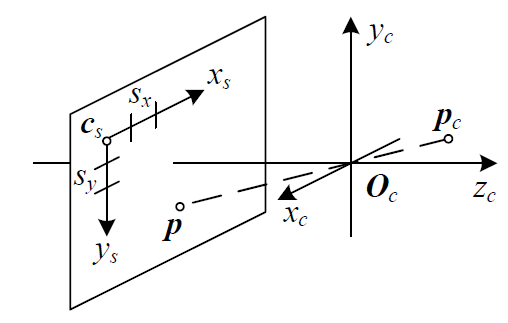
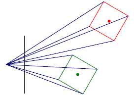
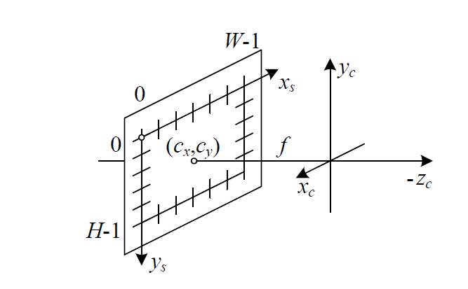
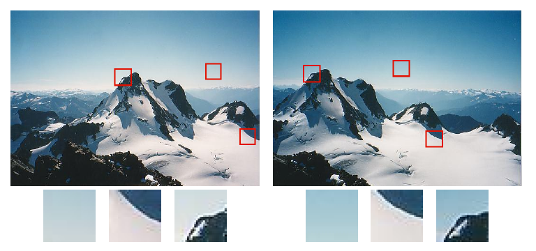
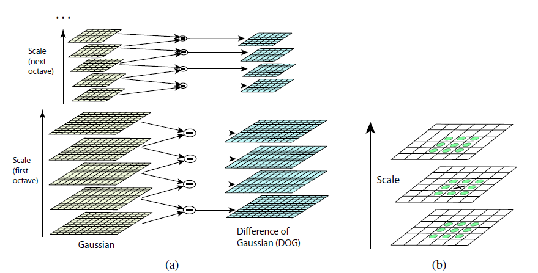
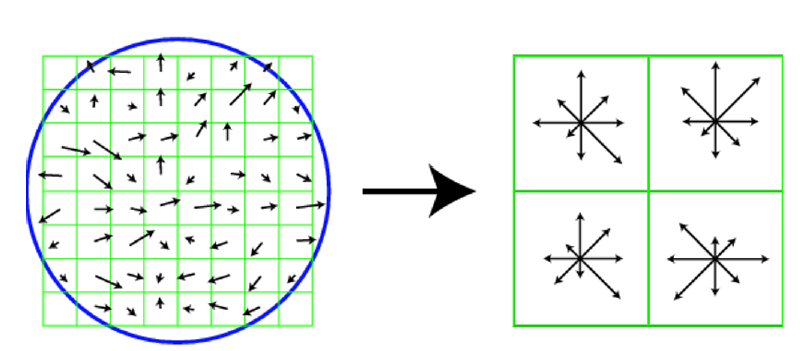
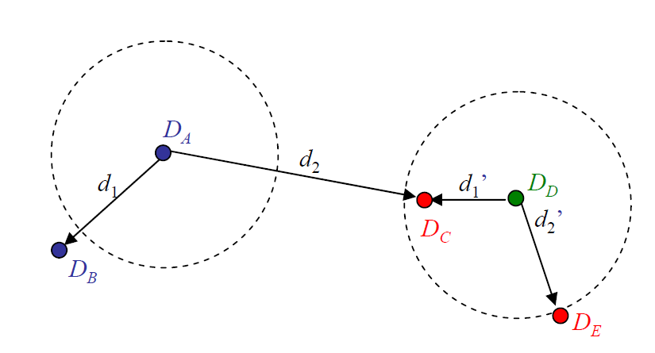
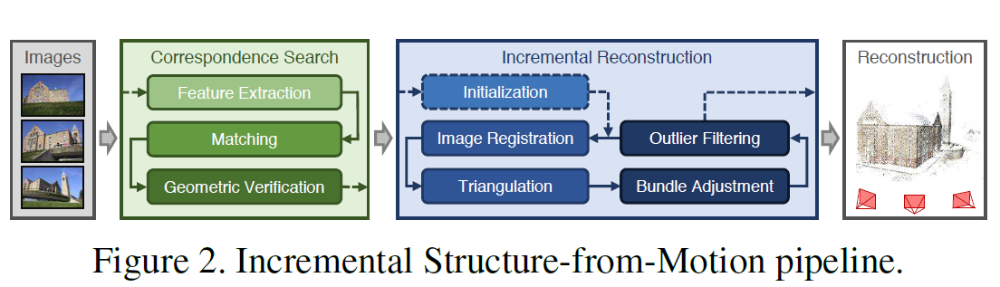
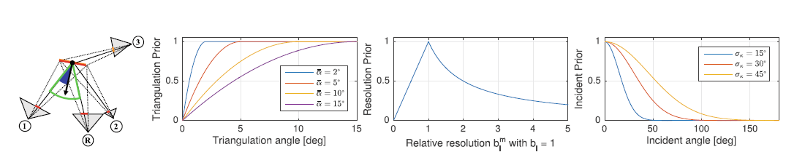

::: site-section-nav
[Home](index.qmd) [Motivation & Use-Cases](einleitung.qmd) [Theorie](theorie.qmd){.active} [Methoden-Vergleich](vergleich.qmd) [Praktisches Beispiel](hands-on.qmd) [Quellen](quellen.qmd)
:::

```{=html}
<div class="page-overview">
  <div class="poc">
    <div class="poc-num">1</div>
    <div class="poc-title">Pinhole-Kameramodell</div>
    <div class="poc-desc">Projektion, Kalibrierung, intrinsische und extrinsische Parameter</div>
  </div>
  <div class="poc">
    <div class="poc-num">2</div>
    <div class="poc-title">Structure from Motion</div>
    <div class="poc-desc">Features, Epipolargeometrie, Triangulation, Bundle Adjustment</div>
  </div>
  <div class="poc">
    <div class="poc-num">3</div>
    <div class="poc-title">Multi-View Stereo</div>
    <div class="poc-desc">Dichte Rekonstruktion, View Selection, Fusion</div>
  </div>
  <div class="poc">
    <div class="poc-num">4</div>
    <div class="poc-title">COLMAP</div>
    <div class="poc-desc">Vollständige Pipeline in der Praxis</div>
  </div>
</div>
```

## 1. Das Pinhole-Kameramodell

### Die Grundidee

Eine Lochkamera (Pinhole Camera) ist das einfachste denkbare Kameramodell. Lichtstrahlen aus der Szene laufen durch einen einzigen Punkt — den **optischen Mittelpunkt** — und treffen auf die Bildebene dahinter.

{fig-align="left" width="25%"}

Ein 3D-Punkt $\mathbf{p}_c$ in Kamerakoordinaten wird auf einen 2D-Bildpunkt $\mathbf{p}$ abgebildet. Alle Sichtstrahlen laufen durch den optischen Mittelpunkt $O_c$.

### Die Projektion: inhomogene und homogene Koordinaten

Der Schlüssel ist die perspektivische Projektion durch Division durch die Tiefe $z$. In **inhomogenen Koordinaten**:

$$\bar{x} = P_z(\mathbf{p}) = \left(\frac{x}{z}, \frac{y}{z}\right)$$

Eine Division lässt sich nicht als Matrixmultiplikation schreiben. Deshalb führt man **homogene Koordinaten** ein: Ein 3D-Punkt wird um eine Koordinate $w$ erweitert, in der Standardrepräsentation $w=1$:

$$\mathbf{x}_h = (x, y, z, 1)^T$$

Damit lässt sich die Projektion als reine Matrixmultiplikation schreiben:

$$\tilde{x} = \begin{bmatrix} 1 & 0 & 0 & 0 \\ 0 & 1 & 0 & 0 \\ 0 & 0 & 1 & 0 \end{bmatrix} \tilde{\mathbf{p}} = P \cdot \tilde{\mathbf{p}}$$

Die Division durch $z$ erfolgt erst am Ende, bei der **Dehomogenisierung**: $\bar{x} = (x_h/w_h, y_h/w_h)$.

:::: workflow-grid
::: workflow-card
<strong>Fun Fact</strong><br><br> Neben der perspektivischen Projektion existieren weitere Modelle (Orthographie, Para-Perspektive). Für SfM und MVS ist ausschließlich die perspektivische Projektion relevant, da sie das Verhalten realer Kameras am besten modelliert.
:::
::::

{fig-align="left" width="20%"}

### Intrinsische Parameter: die Kalibriermatrix K

{fig-align="left" width="28%"}

Die vollständige Kalibriermatrix:

$$K = \begin{pmatrix} f_x & s & c_x \\ 0 & f_y & c_y \\ 0 & 0 & 1 \end{pmatrix}$$

| Parameter  | Bedeutung                                           |
|------------|-----------------------------------------------------|
| $f_x, f_y$ | Brennweite in Pixeln (x- und y-Richtung)            |
| $c_x, c_y$ | Hauptpunkt: wo trifft die optische Achse den Sensor |
| $s$        | Skew (Scherung zwischen den Pixelachsen)            |

In der Praxis vereinfacht sich $K$ stark: Moderne Sensoren haben quadratische Pixel ($f_x = f_y = f$) und keinen Skew ($s=0$):

$$K = \begin{pmatrix} f & 0 & c_x \\ 0 & f & c_y \\ 0 & 0 & 1 \end{pmatrix}$$

Diese vereinfachte Form wird in der Praxis und auch in SfM standardmäßig verwendet. $K$ beschreibt die **Kamera selbst** — unabhängig davon, wo sie steht.

### Extrinsische Parameter: R und t

$K$ beschreibt die Kamera, aber nicht wo sie **steht**. Dafür gibt es:

::::: workflow-grid
::: workflow-card
<strong>Rotation R</strong><br><br> Eine 3×3-Rotationsmatrix, die die Orientierung der Kamera beschreibt (orthogonal, $\det(R)=1$).
:::

::: workflow-card
<strong>Translation t</strong><br><br> Ein 3D-Vektor, der die Position der Kamera relativ zum Weltkoordinatensystem beschreibt.
:::
:::::

### Die vollständige Kameramatrix

Intrinsics und Extrinsics zusammen ergeben die **Kameramatrix**:

$$P = K[R\mid \mathbf{t}]$$

Damit lässt sich jeder Weltpunkt direkt in einen Bildpunkt umrechnen:

$$\tilde{x} = P \cdot \tilde{\mathbf{p}} = K[R\mid\mathbf{t}]\cdot\tilde{\mathbf{p}}$$

R und t sind dabei für die **erste** Kamera per Konvention $R=I$, $\mathbf{t}=\mathbf{0}$. Sie definiert den Ursprung der Welt. Genau diese Matrix $P$ ist es, die SfM für **jedes** Bild zu schätzen versucht.

## 2. Structure from Motion (SfM)

### Das Grundprinzip

SfM löst das **inverse Problem** der Kameraprojektion: Gegeben mehrere Fotos, rekonstruiere gleichzeitig die Kamerapositionen und die 3D-Struktur der Szene.

### Feature Detection

Um aus mehreren Bildern eine 3D-Struktur zu rekonstruieren, müssen wir wissen welche Punkte in verschiedenen Bildern denselben 3D-Punkt zeigen. Dafür brauchen wir Features. Charakteristische, wiedererkennbare Punkte im Bild.

{fig-align="center" width="35%"}

### SIFT

Bevor zwei Bilder verglichen werden können, müssen charakteristische **Keypoints** gefunden werden — Stellen, die unter Skalierung stabil bleiben. Der bekannteste Algorithmus ist **SIFT** (Lowe, 2004).

**Detektor — Difference of Gaussian (DoG):**

$$DoG\{I;\sigma_1,\sigma_2\} = G_{\sigma_1} * I - G_{\sigma_2} * I$$

- $I$ = das Eingangsbild
- $G_{\sigma_1}, G_{\sigma_2}$ = zwei unterschiedliche Glättungsfaktoren (Gaußfilter)
- $DoG$ = die Differenz dieser beiden geglätteten Bilder

Gesucht werden lokale Extrema in Raum **und** Skala — ein Pixel wird mit seinen 26 Nachbarn im 3×3×3-Würfel (aktuelle und benachbarte Skalenebenen) verglichen.

{fig-align="left" width="35%"}

**Deskriptor — Gradientenhistogramm:**

Jeder gefundene Keypoint wird durch ein Gradientenhistogramm eindeutig beschrieben:

- Fenster: 16×16 Pixel um den Keypoint
- Unterteilung: 4×4 Unterregionen
- Pro Unterregion: 8-Bin Gradientenhistogramm
- Ergebnis: $4 \times 4 \times 8 = 128$-dimensionaler Vektor

{fig-align="left" width="28%"}

Links im Bild sind die rohen Gradienten dargestellt: Richtung und Stärke der Helligkeitsänderung an jedem Pixel innerhalb des 16×16 Fensters. Rechts ist das Ergebnis pro Unterregion zu sehen — die Sternform-Diagramme zeigen das 8-Bin-Histogramm, wobei die Länge in jede Richtung die Häufigkeit der jeweiligen Gradientenorientierung darstellt.

::::: workflow-grid
::: workflow-card
<strong>Warum 8 Richtungen?</strong><br><br> Die Zahl von 8 Hauptrichtungen ist eine empirisch gewählte Designentscheidung von Lowe (2004): ein Kompromiss zwischen ausreichender Genauigkeit und Robustheit gegenüber Rauschen.
:::

::: workflow-card
<strong>Vereinfachte Abbildung</strong><br><br> Die Abbildung zeigt aus Darstellungsgründen eine vereinfachte Version mit 8×8 Pixel Fenster und 2×2 Unterregionen. Lowe's tatsächliche Implementierung nutzt 16×16 Pixel mit 4×4 Unterregionen, wie oben beschrieben.
:::
:::::

### Feature Matching: Nearest Neighbor Distance Ratio

Um Keypoints zwischen zwei Bildern zuzuordnen, sucht man für jeden Deskriptor $D_A$ den nächsten Nachbarn $D_B$ (Distanz $d_1$) und den zweitnächsten Nachbarn $D_C$ (Distanz $d_2$) im 128-dimensionalen Feature-Raum:

$$NNDR = \frac{d_1}{d_2} = \frac{\|D_A - D_B\|}{\|D_A - D_C\|}$$

- Ist NNDR **klein** → $D_B$ ist deutlich besser als $D_C$ → sicherer Match
- Ist NNDR **nah bei 1** → $D_B$ und $D_C$ sind ähnlich gut → unsicherer Match, eher verwerfen

Diese Methode wurde von Lowe (2004) vorgeschlagen und passt sich automatisch an unterschiedliche Bildregionen an, ganz ohne festen globalen Schwellwert.

{fig-align="left" width="28%"}

:::: workflow-grid
::: workflow-card
<strong>Bezug zu COLMAP</strong><br><br> COLMAP nutzt für das Matching standardmäßig genau diese NNDR-Methode (L2-Distanz mit Ratio-Test). Für die Nearest-Neighbor-Suche selbst setzt COLMAP approximative Verfahren ein (ursprünglich FLANN, in neueren Versionen Faiss), um bei vielen Bildern effizient zu bleiben.
:::
::::

### RANSAC: Ausreißer entfernen

Trotz NNDR-Filterung enthalten die Matches noch fehlerhafte Korrespondenzen. **RANSAC** (Random Sample Consensus) findet robust eine Lösung, die mit der größten Anzahl an Korrespondenzen konsistent ist.

**Algorithmus:**

1.  Wähle zufällig $k$ Korrespondenzen
2.  Schätze daraus die Modellparameter (z.B. die Essential Matrix $E$)
3.  Zähle Inliers: $\|r_i\| \leq \epsilon$
4.  Wiederhole $S$ mal → behalte die beste Lösung

$k$ ergibt sich aus den Freiheitsgraden des jeweiligen Modells (4 für eine Homographie, 5 für die Essential Matrix, 7–8 für die Fundamentalmatrix) — es ist die minimale Anzahl an Punkten, die nötig ist, um das Modell eindeutig zu bestimmen.

**Herleitung der nötigen Durchläufe S:**

Sei $p$ die Wahrscheinlichkeit, dass eine einzelne zufällig gezogene Korrespondenz korrekt ist. Die Wahrscheinlichkeit, dass *alle* $k$ gezogenen Punkte gleichzeitig korrekt sind, ist $p^k$. Damit ist die Wahrscheinlichkeit, dass ein einzelner Durchlauf fehlschlägt, $(1-p^k)$. Damit *alle* $S$ Durchläufe fehlschlagen:

$$1-P = (1-p^k)^S$$

Aufgelöst nach $S$:

$$S = \frac{\log(1-P)}{\log(1-p^k)}$$

mit $p, P \in [0,1]$: $p$ ist die angenommene Inlier-Wahrscheinlichkeit (anfangs pessimistisch geschätzt, z.B. $p=0{,}5$), $P$ die gewünschte Erfolgswahrscheinlichkeit, dass nach $S$ Durchläufen mindestens einmal eine vollständig korrekte $k$-Stichprobe gezogen wurde.

### Epipolargeometrie und die Essential/Fundamentalmatrix

Zwei Kameras, die denselben 3D-Punkt $\mathbf{p}$ aus unterschiedlichen Positionen beobachten, spannen mit ihren Projektionszentren $c_0, c_1$ eine **Epipolarebene** auf.

**Essential Matrix** (kalibrierte Kameras, $\hat{x} = K^{-1}x$ normalisierte Koordinaten):

$$E = [\mathbf{t}]_\times R, \qquad \hat{x}_1^T E \hat{x}_0 = 0$$

**Fundamentalmatrix** (unkalibrierte Kameras, rohe Pixelkoordinaten):

$$F = K_1^{-T}EK_0^{-1}, \qquad x_1^T F x_0 = 0$$

#### Herleitung

Kamera 0 sitzt im Ursprung. Der 3D-Punkt wird in Sicht von Kamera 1 transformiert:

$$d_1\hat{x}_1 = R(d_0\hat{x}_0) + \mathbf{t}$$

Bildet man auf beiden Seiten das Kreuzprodukt mit $\mathbf{t}$, verschwindet der additive $\mathbf{t}$-Term (da $\mathbf{t}\times\mathbf{t}=0$):

$$d_1[\mathbf{t}]_\times \hat{x}_1 = d_0[\mathbf{t}]_\times R\hat{x}_0$$

Skalarprodukt beider Seiten mit $\hat{x}_1$: Die linke Seite wird ein Spatprodukt mit zwei identischen Vektoren ($\hat{x}_1$ kommt doppelt vor) und ist damit immer 0:

$$d_0\,\hat{x}_1^T([\mathbf{t}]_\times R)\hat{x}_0 = 0$$

Da $d_0$ nur eine positive Zahl ist, kann man durch sie teilen — die unbekannte Tiefe $d_0$ verschwindet vollständig aus der Gleichung:

$$\hat{x}_1^T E \hat{x}_0 = 0, \qquad E := [\mathbf{t}]_\times R$$

Das ist das eigentliche Genie dieses Tricks: Die Bedingung hängt nur noch von den bekannten Bildmessungen und den gesuchten Kameraparametern ab — nicht von der unbekannten Tiefe.

:::: workflow-grid
::: workflow-card
<strong>Geometrische Bedeutung</strong><br><br> Da die Tiefe $d_0$ in der Herleitung verschwindet, gilt die Bedingung für *jeden* möglichen Punkt auf dem Sichtstrahl von Kamera 0 gleichermaßen. Die Projektion des gesamten Sichtstrahls in Bild 1 ist deshalb keine einzelne Position, sondern eine ganze **Epipolarlinie**.
:::
::::

#### Schätzung von R, t aus E

Aus der geschätzten Essential Matrix lassen sich $R$ und $\mathbf{t}$ über eine Singulärwertzerlegung extrahieren:

$$E = U\Sigma V^T$$

Das liefert **vier mögliche Kombinationen** von $(R,\mathbf{t})$ durch eine Vorzeichen-Ambiguität. Die korrekte Kombination wird über den **Cheiralitätstest** ausgewählt: Man trianguliert testweise die 3D-Punkte für jede Kombination und prüft, ob sie **vor beiden Kameras** liegen (positive Tiefe) — physikalisch kann eine Kamera nur Punkte sehen, die vor ihr liegen.

::::: workflow-grid
::: workflow-card
<strong>Skalierungsambiguität</strong><br><br> Selbst nach Auswahl der korrekten Kombination bleibt nur die **Richtung** von $\mathbf{t}$ bestimmbar, nicht die absolute Distanz zwischen den Kameras. Die metrische Größe der Szene erfordert zusätzliche Information (Referenzdistanzen, GPS/Ground Control Points).
:::

::: workflow-card
<strong>Bezug zu COLMAP</strong><br><br> Da die Intrinsics meist bekannt sind (EXIF-Metadaten), arbeitet COLMAP standardmäßig mit der Essential Matrix und dem 5-Punkt-Algorithmus ($k=5$) statt mit der Fundamentalmatrix.
:::
:::::

### Triangulation: erste 3D-Punkte

Mit bekannten Kameramatrizen $P_0, P_1$ lässt sich aus zwei korrespondierenden 2D-Bildpunkten der zugehörige 3D-Punkt rekonstruieren.

In der Praxis schneiden sich die beiden Sichtstrahlen wegen Messrauschen nicht exakt (im 3D-Raum können sich zwei Geraden — anders als in 2D — auch ganz allgemein windschief zueinander verhalten, ohne sich je zu treffen). Gesucht wird daher der Punkt $\mathbf{p}$, der zu **beiden** Strahlen gleichzeitig den kleinsten Abstand hat.

Der nächste Punkt auf einem Strahl $j$ zu einem angenommenen $\mathbf{p}$:

$$q_j = c_j + (\hat{v}_j\hat{v}_j^T)(\mathbf{p}-c_j)$$

Das zu minimierende Residuum (Abstand Punkt zu Strahl):

$$r_j^2 = \|(I-\hat{v}_j\hat{v}_j^T)(\mathbf{p}-c_j)\|^2$$

Least-Squares-Lösung für $\mathbf{p}$ (direkt, geschlossene Form — kein Raten nötig):

$$\mathbf{p} = \left[\sum_j(I-\hat{v}_j\hat{v}_j^T)\right]^{-1}\left[\sum_j(I-\hat{v}_j\hat{v}_j^T)c_j\right]$$

### Inkrementeller Aufbau

Ausgehend von einem initialen Bildpaar wird die Rekonstruktion schrittweise um neue Bilder erweitert.

{fig-align="center" width="35%"}

**Kernschritte:**

1.  **Initialisierung:** Start mit einem sorgfältig gewählten Zwei-Bild-Paar (Epipolargeometrie + Triangulation, siehe oben)
2.  **Image Registration:** Ein neues Bild wird über das **Perspective-n-Point Problem (PnP)** zur Rekonstruktion hinzugefügt — die Umkehrung der Triangulation: Statt aus bekannten Posen einen 3D-Punkt zu berechnen, nutzt man bereits bekannte 3D-Punkte und ihre 2D-Position im neuen Bild, um die unbekannte Pose dieser Kamera zu schätzen
3.  **Triangulation:** Mit der neuen Kamera lassen sich weitere 3D-Punkte berechnen, die vorher nicht rekonstruierbar waren
4.  **Bundle Adjustment:** Verfeinerung aller Kameras und Punkte gemeinsam (siehe unten)
5.  **Outlier Filtering:** Entfernung schlechter Punkte

Dieser Zyklus wird wiederholt, bis alle (oder möglichst viele) verfügbaren Bilder registriert sind.

### Bundle Adjustment

Image Registration und Triangulation laufen unabhängig voneinander ab, obwohl ihre Ergebnisse stark zusammenhängen: Fehler in der Kamerapose pflanzen sich in die triangulierten Punkte fort und umgekehrt. Ohne Korrektur driftet die Rekonstruktion zunehmend von der korrekten Lösung ab.

Man nutzt dabei wieder die Projektion mit der Kameramatrix $P$ aus dem Pinhole-Modell: Man vergleicht, wo ein 3D-Punkt laut $P$ projiziert werden *sollte*, mit wo er tatsächlich *gemessen* wurde (Feature Matching). Diese Differenz heißt **Reprojection Error**.

$$E = \sum_j \rho_j\left(\|P_c\cdot X_k - x_j\|_2^2\right)$$

- $P_c$ = Kameramatrix der Kamera $c$ ($K[R|t]$)
- $X_k$ = 3D-Punkt $k$
- $x_j$ = tatsächlich gemessene 2D-Position
- $\rho_j$ = robuste Verlustfunktion (schwächt Ausreißer ab, ähnliches Prinzip wie bei RANSAC)

Über alle Beobachtungen $j$ summiert wird die quadrierte Differenz zwischen Vorhersage und Messung minimiert — eine nicht-lineare Least-Squares-Optimierung über alle Kameras und Punkte gleichzeitig.

:::: workflow-grid
::: workflow-card
<strong>Bezug zu COLMAP</strong><br><br> COLMAP löst dieses Optimierungsproblem nicht nach jedem einzelnen Schritt vollständig neu, da das bei großen Bildmengen zu rechenintensiv wäre. Stattdessen führt COLMAP nach jeder neuen Bildregistrierung ein **lokales** Bundle Adjustment durch (nur über die am stärksten verbundenen Kameras). Ein **globales** Bundle Adjustment über die gesamte Rekonstruktion wird nur periodisch ausgeführt. Gelöst wird das nicht-lineare Problem mit dem Levenberg-Marquardt-Algorithmus, konkret über die Ceres-Solver-Bibliothek.
:::
::::

:::: workflow-grid
::: workflow-card
<strong>Ergebnis von SfM</strong><br><br> Sparse Point Cloud: spärliche 3D-Punkte an robust gematchten Feature-Stellen. Kalibrierte Kameraposen: $P_c = K_c[R_c|\mathbf{t}_c]$ für jedes registrierte Bild.
:::
::::

## 3. Multi-View Stereo (MVS)

### Von Sparse zu Dense

SfM liefert eine **spärliche** Punktwolke - nur für Punkte, die robust über mehrere Bilder gematcht und trianguliert werden konnten. MVS nutzt die SfM-Ergebnisse (Kamerapositionen $P_c$, spärliche Punkte) als Grundlage, um für **jedes Pixel** in jedem Bild eine Tiefe zu schätzen.

COLMAP implementiert dafür den Ansatz von Schönberger, Zheng, Pollefeys & Frahm (2016), der auf dem Optimierungsrahmen von Zheng et al. (2014) aufbaut. Die Kernidee: Für jeden Pixel im Referenzbild wird unter mehreren Nachbarbildern (Source Images) eine **pixelweise Auswahl** getroffen, basierend auf photometrischer Ähnlichkeit und geometrischen Kriterien.

### Photometrische Konsistenz und View Selection

Für einen Pixel $l$ im Referenzbild mit Tiefe $\theta_l$ wird die Sichtbarkeit in einem Nachbarbild $m$ über eine binäre Indikatorvariable $Z_l^m \in \{0,1\}$ modelliert. Die Wahrscheinlichkeit, dass der Referenz-Patch im Quellbild $m$ sichtbar ist, hängt von der photometrischen Ähnlichkeit $\rho_l^m$ (Normalized Cross-Correlation) ab:

$$P(X_l^m \mid Z_l^m, \theta_l) = \begin{cases} \dfrac{1}{N_A}\exp\!\left(-\dfrac{(1-\rho_l^m(\theta_l))^2}{2\sigma_\rho^2}\right) & \text{falls } Z_l^m=1 \\[6pt] \dfrac{1}{N_U} & \text{falls } Z_l^m=0 \end{cases}$$

Ist der Patch verdeckt ($Z_l^m=0$), wird eine Gleichverteilung angenommen - die Farbwerte sind dann statistisch unabhängig. Ist er sichtbar, ist eine hohe Ähnlichkeit $\rho_l^m$ wahrscheinlicher.

### Geometrische Priors

Reine photometrische Auswahl bevorzugt Bildpaare mit kleiner Basislinie (ähnliche Blickwinkel) - diese liefern aber kaum Tiefeninformation. Schönberger et al. führen deshalb drei geometrische Priors ein, die zusätzlich in die Auswahl einfließen:

{fig-align="center" width="60%"}

**Triangulations-Prior.** Der Winkel zwischen den Sichtstrahlen von Referenz- und Quellkamera zum 3D-Punkt $p_l$:

$$\alpha_l^m = \cos^{-1}\frac{(p_l - c^m)^T p_l}{\|p_l - c^m\| \, \|p_l\|}$$

Ist dieser Winkel zu klein, liefert das Bildpaar kaum Tiefeninformation (der Punkt könnte entlang des Sichtstrahls verschoben werden, ohne die Farbähnlichkeit zu ändern). Die Likelihood-Funktion bestraft deshalb kleine Winkel unterhalb eines Schwellwerts $\bar\alpha$:

$$P(\alpha_l^m) = 1 - \left(\frac{\min(\bar\alpha, \alpha_l^m) - \bar\alpha}{\bar\alpha}\right)^2$$

**Auflösungs-Prior.** Das Verhältnis der Patch-Flächen zwischen Referenz- ($b_l$) und Quellbild ($b_l^m$):

$$\beta_l^m = \frac{b_l}{b_l^m}$$

Liegt $\beta_l^m$ nahe bei 1, haben beide Patches ähnliche Auflösung und Form. Die Likelihood-Funktion bevorzugt Werte nahe 1:

$$P(\beta_l^m) = \min\left(\beta_l^m, (\beta_l^m)^{-1}\right)$$

**Einfallswinkel-Prior.** Der Winkel $\kappa_l^m$ zwischen der Blickrichtung der Quellkamera und der geschätzten Flächennormale $n_l^m$ am Punkt:

$$\kappa_l^m = \cos^{-1}\frac{(p_l-c^m)^T n_l^m}{\|p_l-c^m\|\,\|n_l^m\|}$$

Geometrisch kann eine Kamera eine Fläche nur sehen, wenn $\kappa_l^m < \tfrac{\pi}{2}$ gilt. Die Likelihood-Funktion gewichtet entsprechend:

$$P(\kappa_l^m) = \exp\left(-\frac{(\kappa_l^m)^2}{2\sigma_\kappa^2}\right)$$

### Kombinierte View-Selection-Verteilung

Alle Priors werden zusammen mit dem photometrischen Term zu einer Sampling-Verteilung kombiniert, aus der pro Pixel die informativsten Quellbilder gezogen werden:

$$P_l(m) = \frac{q(Z_l^m=1)\,q(\alpha_l^m)\,q(\beta_l^m)\,q(\kappa_l^m)}{\sum_{m=1}^{M} q(Z_l^m=1)\,q(\alpha_l^m)\,q(\beta_l^m)\,q(\kappa_l^m)}$$

Anschaulich: Nicht verdeckte Bilder mit ausreichender Basislinie, ähnlicher Auflösung und frontalem Blickwinkel werden bei der Tiefenschätzung für diesen Pixel bevorzugt herangezogen.

:::: workflow-grid
::: workflow-card
<strong>Optimierungsverfahren</strong><br><br> Die vollständige Inferenz von Tiefe, Normalen und Sichtbarkeit über alle Pixel löst Schönberger et al. mit einem Generalized-Expectation-Maximization-Algorithmus (GEM), kombiniert mit PatchMatch-Sampling für die Tiefen-/Normalenschätzung und einem Forward-Backward-Algorithmus für die Sichtbarkeitsvariablen. Diese Optimierungsdetails sind reine Implementierungsmechanik und für das Verständnis des Verfahrens nicht zwingend notwendig - entscheidend ist die Struktur der Likelihood-Funktion und der Priors oben.
:::
::::

### Tiefenkarte pro Bild

Mit den View-Selection-Wahrscheinlichkeiten als Grundlage schätzt MVS für jedes einzelne Pixel im Referenzbild eine optimale Tiefe $\theta_l$ (und in der erweiterten Fassung von Schönberger et al. zusätzlich eine Flächennormale $n_l$), indem die photometrische Inkonsistenz über die ausgewählten Quellbilder minimiert wird:

$$(\hat\theta_l^{opt}, \hat n_l^{opt}) = \arg\min_{\theta_l^*, n_l^*} \frac{1}{|S|}\sum_{m \in S} \left(1-\rho_l^m(\theta_l^*, n_l^*)\right)$$

wobei $S$ die Menge der für diesen Pixel ausgewählten Quellbilder ist. Das Ergebnis ist eine sogenannte **Tiefenkarte** pro Bild.

### Geometrische Konsistenz

Photometrische Ambiguitäten (z.B. bei wenig Textur) lassen sich oft durch den Abgleich mit anderen Tiefenkarten auflösen. Schönberger et al. definieren dafür den Vorwärts-Rückwärts-Reprojektionsfehler:

$$\psi_l^m = \|x_l - H_l^m H_l x_l\|$$

wobei $H_l$ die projektive Transformation vom Referenz- ins Quellbild ist und $H_l^m$ die Rücktransformation. Stimmen die Tiefen- und Normalenschätzungen zwischen den Bildern überein, ist $\psi_l^m$ klein.

### Zusammenführung zu dichten Punktwolken (Fusion)

Die einzelnen Tiefenkarten enthalten Redundanzen und Inkonsistenzen. Im Fusion-Schritt werden konsistente Schätzungen aus mehreren Bildern zu einer einheitlichen, dichten 3D-Punktwolke zusammengeführt. Ein Pixel gilt als verlässlich (Inlier), wenn es sowohl photometrisch als auch geometrisch von mindestens $s$ Bildern unterstützt wird:

$$S_l^{pho} = \{x_l^m \mid q(Z_l^m) > \bar q_Z\}, \qquad S_l^{geo} = \{x_l^m \mid q(\alpha_l^m)\geq \bar q_\alpha,\ q(\beta_l^m)\geq \bar q_\beta,\ q(\kappa_l^m) > \bar q_\kappa,\ \psi_l^m < \psi_{max}\}$$

Pixel mit ausreichender, konsistenter Unterstützung werden zu einem gemeinsamen 3D-Punkt fusioniert (Median-Position, gemittelte Normale); schwach unterstützte Pixel werden verworfen.

::::: workflow-grid
::: workflow-card
<strong>Ergebnis von MVS</strong><br><br> Dichte Punktwolke mit Tiefe und Normale pro Punkt: um Größenordnungen mehr Punkte als SfM.
:::

::: workflow-card
<strong>Hinweis zum Meshing</strong><br><br> Da jeder fusionierte Punkt bereits eine geschätzte Normale besitzt, lässt sich daraus direkt ein Mesh erzeugen, üblicherweise über Poisson Surface Reconstruction (Kazhdan & Hoppe, 2013) — von Schönberger et al. selbst als optionaler letzter Schritt genannt.
:::
:::::

## 4. COLMAP in der Praxis

### Was ist COLMAP?

COLMAP ist eine quelloffene SfM+MVS-Pipeline, entwickelt von Johannes Schönberger u.a. an der ETH Zürich. Sie setzt die oben beschriebene Theorie konkret um.

### Die COLMAP-Pipeline

::::::: workflow-grid
::: workflow-card
<strong>① Feature Extraction</strong><br><br> SIFT-Keypoints und 128-dim Deskriptoren für jedes Bild.
:::

::: workflow-card
<strong>② Feature Matching</strong><br><br> NNDR-Matching, geometrische Verifikation mit RANSAC. Pairing-Strategie wählbar: Exhaustive, Sequential oder Vocabulary Tree (löst das Skalierungsproblem bei vielen Bildern, da nicht jedes Bild gegen jedes andere getestet werden muss).
:::

::: workflow-card
<strong>③ Sparse Reconstruction</strong><br><br> Inkrementelles SfM: Kameraposen und sparse Punktwolke.
:::

::: workflow-card
<strong>④ Dense Reconstruction</strong><br><br> MVS-Tiefenkartenschätzung und Fusion zur dichten Punktwolke.
:::
:::::::
